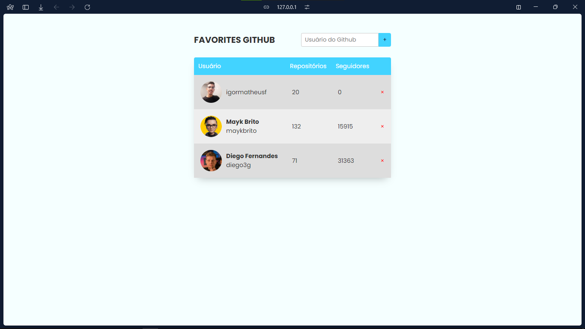

<h1 align="center">Projeto Github Favorites</h1>

  <a href="#-preview">Preview</a>&nbsp;&nbsp;&nbsp;|&nbsp;&nbsp;&nbsp;
  <a href="#-tecnologias">Tecnologias</a>&nbsp;&nbsp;&nbsp;|&nbsp;&nbsp;&nbsp;
  <a href="#-projeto">Projeto</a>&nbsp;&nbsp;&nbsp;|&nbsp;&nbsp;&nbsp;
  <a href="#-layout">Layout</a>

 

## 🖥 Preview

## 🚀 Tecnologias

Esse projeto foi desenvolvido com as seguintes tecnologias:

- HTML
- CSS
- JavaScript
- Git e Github
- Figma

## 💻 Projeto

O Github Favorites trata-se de uma aplicação para cadastro de perfis do Github como favoritos, sendo possível extrair os dados em tempo real do usuário, por meio de API.

Principais conceitos trabalhados:
- Acessibilidade para leitores de tela
- Manipulação da DOM
- Criação e interação de botões
- Classes, herança, promessas e HTML no JS
- Imutabilidade
- localStorage
- Async await
- ES6 Modules: Import/Export
- Validação de dados

## 🔖 Layout

Você pode visualizar o layout do projeto através [DESSE LINK](https://www.figma.com/design/kiVY8HmePTV5sNhUm5S3z9/%5BDesafios-Explorer%5D-GitFav-(Copy)-(Copy)?m=auto&t=AEuEEoqv5quVrN68-6), no Figma. 
designed by Rocketseat